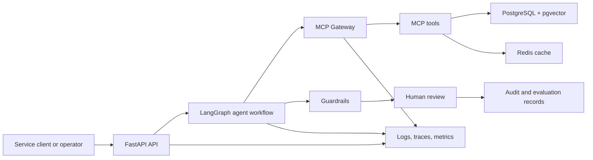

# Financial Research Agent

Financial Research Agent is a production-shaped financial research and platform intelligence system. It combines MCP-based tool access, retrieval-augmented generation, LangGraph workflows, guardrails, caching, auditability, human review, evaluation pipelines, and observability.

The system is designed for local development and production-oriented service boundaries. It does **not** provide investment advice, does not use real client data, and keeps human review and responsible AI checks in the core workflow.

## Product Vision

This project transforms time-consuming fund research, evidence gathering, analysis, and report writing into a trusted AI-powered research workflow, helping financial researchers quickly generate evidence-backed, reviewable, and traceable insights so humans can focus on judgment while AI accelerates discovery.

Expected visual result:

```text
┌──────────────────────────────────────────────────────────────────────────────┐
│ Financial Research Agent                                      Run ID: R-1024 │
├──────────────────────────────────────────────────────────────────────────────┤
│ Ask a research question                                                      │
│ ┌──────────────────────────────────────────────────────────────────────────┐ │
│ │ Compare Fund A and Fund B based on performance, risk, fees, and style.   │ │
│ └──────────────────────────────────────────────────────────────────────────┘ │
│ [Generate Research Brief]                                                    │
├───────────────────────────────┬──────────────────────────────────────────────┤
│ Agent Workflow                │ Research Output                              │
│                               │                                              │
│ ✓ Plan created                │ Fund A vs Fund B                             │
│ ✓ Fund metrics retrieved      │                                              │
│ ✓ Documents searched          │ Summary                                      │
│ ✓ Citations selected          │ Fund A shows stronger recent performance,    │
│ ✓ Guardrails passed           │ while Fund B has lower volatility and fees.  │
│ ○ Human review pending        │                                              │
│                               │ Metrics                                      │
│ Tool Trace                    │ ┌──────────┬────────┬────────┬────────────┐  │
│ - fund_metrics                │ │ Fund     │ Return │ Risk   │ Fee        │  │
│ - document_retrieval          │ ├──────────┼────────┼────────┼────────────┤  │
│ - citation_validator          │ │ Fund A   │ 8.2%   │ High   │ 0.72%      │  │
│ - pii_filter                  │ │ Fund B   │ 6.9%   │ Medium │ 0.45%      │  │
│ - moderation                  │ └──────────┴────────┴────────┴────────────┘  │
│                               │                                              │
│ Latency: 2.4s                 │ Key Evidence                                 │
│ Cache hit rate: 67%           │ [1] Annual report, page 4                    │
│                               │ [2] Fund factsheet, Q3 section               │
├───────────────────────────────┴──────────────────────────────────────────────┤
│ Responsible AI Review                                                        │
│ PII: Passed | Moderation: Passed | Financial Advice Safety: Passed           │
│ Citation Coverage: 92% | Faithfulness: Passed | Prompt Injection: Passed     │
│                                                                              │
│ Reviewer Decision: [Approve] [Request Changes] [Reject]                      │
└──────────────────────────────────────────────────────────────────────────────┘
```

This view emphasizes the end-to-end research chain: a user question becomes an agent plan, MCP tool calls, cited evidence, guardrail checks, and a final human review decision.

Product UI concept:

```text
┌─────────────────────────────────────────────────────────────────────────────────────────────────────────────┐
│ Financial Research Agent        Research Console   Evaluations    Runs    Settings       Search ⌘K   HL     │
├────────────────────────┬──────────────────────────────────────────────────────────────┬─────────────────────┤
│ New Research Run       │ Fund Comparison Brief                         Draft saved    │ Evidence & Controls │
│                        │                                                              │                     │
│ Task                   │ ┌──────────────────────────────────────────────────────────┐ │ Evidence Coverage   │
│ ● Fund comparison      │ │ Compare Fund A and Fund B                                │ │ █████████░ 92%      │
│ ○ Due diligence brief  │ │                                                          │ │                     │
│ ○ Platform issue scan  │ │ Fund A has stronger three-year performance and higher    │ │ Cited Sources       │
│                        │ │ volatility. Fund B appears more cost-efficient and may   │ │ [1] Annual report   │
│ Funds                  │ │ fit lower-risk allocation screens.                       │ │ [2] Factsheet Q3    │
│ [ Fund A        v ]    │ │                                                          │ │ [3] Risk summary    │
│ [ Fund B        v ]    │ │ Key concerns                                             │ │                     │
│                        │ │ - Fund A concentration risk increased in recent periods. │ │ MCP Tool Trace      │
│ Question               │ │ - Fund B trails in upside capture during growth rallies. │ │ ✓ fund_metrics      │
│ ┌───────────────────┐  │ │                                                          │ │ ✓ document_search   │
│ │ Compare returns,  │  │ │ Analyst checklist                                        │ │ ✓ citation_check    │
│ │ risk, fees, and   │  │ │ ✓ Performance reviewed  ✓ Fees reviewed  ○ Final signoff │ │ ✓ safety_review     │
│ │ style exposure.   │  │ └──────────────────────────────────────────────────────────┘ │                     │
│ └───────────────────┘  │                                                              │ Run Diagnostics     │
│                        │ Metrics                                                      │ Request ID R-1024   │
│ [Generate] [Reset]     │ ┌──────────┬──────────┬──────────┬──────────┬─────────────┐  │ Latency 2.4s        │
│                        │ │ Fund     │3Y Return │Volatility│ Expense  │ Style       │  │ Cache hit 67%       │
│ Recent Runs            │ ├──────────┼──────────┼──────────┼──────────┼─────────────┤  │ Guardrails passed   │
│ R-1024  Pending        │ │ Fund A   │ 8.2%     │ High     │ 0.72%    │ Growth      │  │                     │
│ R-1021  Approved       │ │ Fund B   │ 6.9%     │ Medium   │ 0.45%    │ Blend       │  │ Reviewer Action     │
│ R-1017  Changes        │ └──────────┴──────────┴──────────┴──────────┴─────────────┘  │ [Approve]           │
│                        │                                                              │ [Request Changes]   │
│                        │ Responsible AI Review                                        │ [Reject]            │
│                        │ PII Passed | Moderation Passed | Advice Safety Passed        │                     │
└────────────────────────┴──────────────────────────────────────────────────────────────┴─────────────────────┘
```

This product-style view shows how the same workflow could appear in a real analyst console, with task setup on the left, the generated research brief in the center, and evidence, diagnostics, and approval controls on the right.

## Goals

- Run a local financial research service with FastAPI, PostgreSQL/pgvector, Redis, and Docker Compose.
- Normalize source data into canonical `Document`, `DocumentChunk`, `StructuredRecord`, and `EvalCase` formats before agent use.
- Expose MCP tools through an MCP Gateway with routing, permission boundaries, request ID propagation, audit logging, cache hooks, rate-limit hooks, and structured errors.
- Use LangGraph to orchestrate planning, retrieval, generation, guardrails, review, and persistence.
- Produce citation-aware research answers, due diligence briefs, platform issue summaries, review reports, and anonymized evaluation records.
- Keep outputs traceable through structured JSON logs, audit records, metrics, and repeatable regression reports.

## Non-Goals

- Real investment advice.
- Live brokerage or trading integration.
- Production use with real client data.
- Large-scale document crawling.
- Paid cloud dependencies for normal local development.
- Kubernetes, Kafka, or a separate vector database in the first production release.
- A frontend application unless added by a later requirement.

## Implementation Stack

- Python 3.11+
- FastAPI
- MCP Python SDK, or a minimal MCP-compatible local abstraction where needed
- LangGraph
- PostgreSQL with pgvector
- Redis
- Docker Compose
- OpenTelemetry-compatible instrumentation
- Structured JSON logging
- pytest
- GitHub Actions
- OpenAI-compatible provider adapter, with an expansion path for AWS Bedrock

## Architecture



Suggested package layout:

```text
financial-research-agent/
|- agents/
|- api/
|- mcp_gateway/
|- mcp_server/
|- ingestion/
|- retrieval/
|- eval/
|- storage/
|- llm/
|- observability/
|- config/
|- data/
|- infra/
|- tests/
|- docs/
|- pyproject.toml
|- docker-compose.yml
`- .env.example
```

## System Entry Points

### Batch Ingestion

```http
POST /ingestion/jobs
```

Starts a batch ingestion job for local files, curated sample datasets, or GitHub issues.

Supported first-release source types:

- `local_directory`
- `local_file`
- `sample_dataset`
- `github_issues`

### Research Request

```http
POST /research
```

Runs one user-facing agent workflow.

Supported first-release task types:

- `fund_comparison`
- `due_diligence_brief`
- `financial_qa`
- `platform_issue_research`

### Evaluation Run

```http
POST /eval/runs
```

Runs a batch of evaluation cases and stores anonymized evaluation records plus a regression report.

### Review Decision

```http
POST /review/decisions
```

Allows a reviewer to approve, reject, or request changes for an agent output.

Supported decisions:

- `approved`
- `rejected`
- `changes_requested`

## Core Product Loop

1. A user submits a `ResearchRequest`.
2. The LangGraph planner creates a short research plan.
3. The agent calls MCP tools through the MCP Gateway.
4. MCP tools retrieve structured fund facts, issue metadata, document chunks, and citation candidates.
5. The agent generates a cited answer, due diligence brief, or platform issue summary.
6. Guardrails run before finalization.
7. A human-readable review report is generated.
8. A reviewer approves, rejects, or requests changes.
9. Approved output is stored with audit logs and evaluation metadata.

## MCP Tools

The first production release should expose:

- `fund_search`: search funds by name, category, or identifier.
- `fund_metrics`: return structured metrics for selected funds.
- `document_retrieval`: retrieve relevant chunks with citation metadata.
- `issue_search`: search ingested GitHub issues and comments.
- `citation_validator`: check whether key claims have supporting evidence.
- `pii_filter`: detect and mask PII in inputs and outputs.
- `moderation`: detect unsafe or disallowed content.
- `eval_runner`: run or inspect evaluation cases.

## Data Model

Minimum persisted entities:

- `Fund`
- `Document`
- `DocumentChunk`
- `ResearchRequest`
- `AgentRun`
- `ToolCall`
- `ReviewReport`
- `ReviewDecision`
- `EvaluationCase`
- `EvaluationRun`
- `EvaluationRecord`
- `IngestionJob`
- `CacheRecord`
- `GitHubIssue`
- `GitHubIssueComment`

Minimum audit fields include request ID, user/session placeholder, task type, prompt version, provider/model ID, tool name, tool input hash, output references, retrieved documents, citations, guardrail results, reviewer decisions, latency, cache hit/miss state, and timestamps.

## Responsible AI And Safety

Financial outputs must preserve uncertainty, cite evidence where required, and include safety language when the workflow calls for it. The first release should include:

- PII detection and masking.
- Moderation checks.
- Prompt-injection checks.
- Citation coverage checks.
- Faithfulness checks.
- Unsafe financial advice checks.
- Explicit tool permission boundaries.
- Blocked-output behavior for unsafe or unsupported responses.
- No real client data in local development, tests, fixtures, or examples.

## Local Development

The implementation is expected to run locally through Docker Compose with API, PostgreSQL/pgvector, and Redis services.

Planned setup flow:

```bash
cp .env.example .env
docker compose up --build
pytest
```

This repository currently contains requirements and project foundation documentation. Runtime commands will become available as the implementation phases add `pyproject.toml`, `docker-compose.yml`, application modules, and tests.

## Implementation Phases

| Phase | Goal |
| --- | --- |
| 0 | Project foundation: skeleton, FastAPI app, settings, health endpoint, Docker Compose, logging, pytest, CI |
| 1 | Batch ingestion and storage with canonical normalization, chunking, embedding, pgvector indexing, and audit records |
| 2 | Research Q&A closed loop through LangGraph, MCP Gateway, fund metrics, retrieval, citations, and persistence |
| 3 | Human review and guardrail pipeline |
| 4 | Due diligence brief generator |
| 5 | Platform issue research with GitHub issue ingestion |
| 6 | Caching and performance hardening |
| 7 | Evaluation and anonymized regression pipeline |
| 8 | Deployment notes, observability, metrics, tracing, and operational runbook |

## Release Acceptance Checklist

The release should demonstrate:

- Batch ingestion of sample fund documents and structured fund facts.
- A fund comparison answer with citations.
- A due diligence brief generated from sample data.
- A human-readable responsible AI review report.
- Reviewer approval, rejection, or changes-requested flow.
- MCP tool calls flowing through the gateway.
- Audit logs for tool calls and review decisions.
- GitHub issue ingestion and platform issue research.
- Evaluation report with anonymized examples.
- Cache-hit evidence.
- Docker-based local run.
- Structured logs and metrics.
- Clear documentation and architecture notes.

## License

This project is licensed under the MIT License. See [LICENSE](LICENSE).
